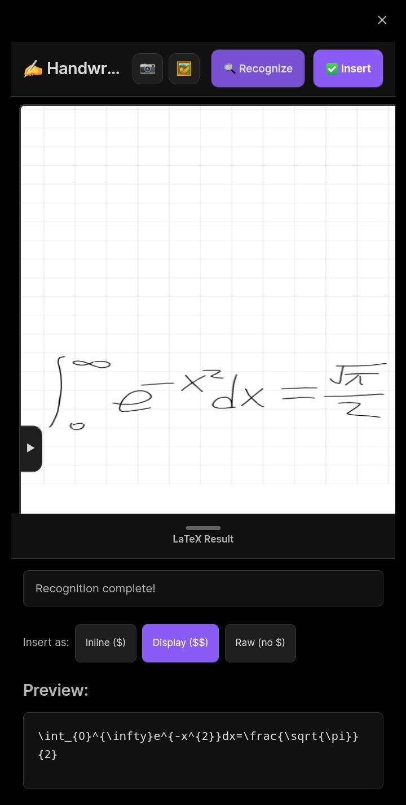
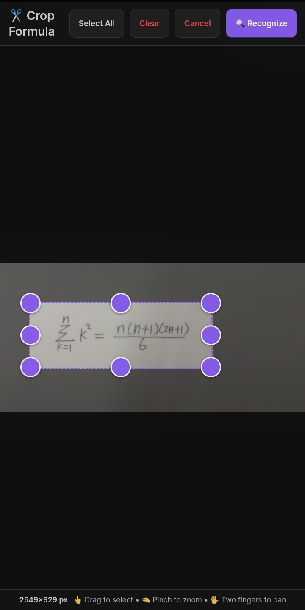
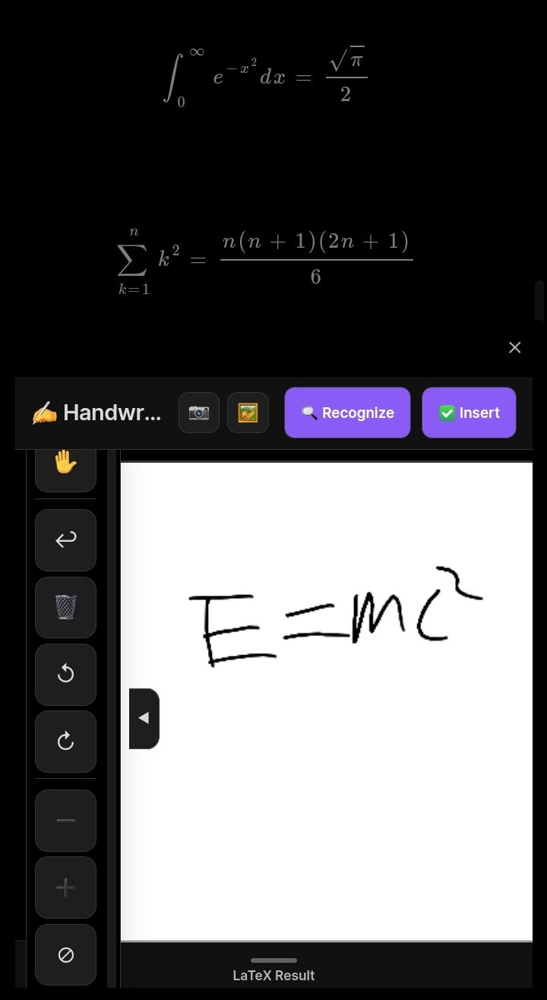

# ✍️ 手写 & 图片转 LaTeX

一款 [Obsidian](https://obsidian.md) 插件，让你可以**手写公式**或**从相册导入图片**，然后通过 AI 识别，一键转换成规范的 **LaTeX 代码**。非常适合做数学笔记、整理学习资料，或者快速在笔记中插入干净美观的公式。

---

## ✨ 主要功能

- 🖊️ **手写画布** – 直接用鼠标、触控笔或手指自由绘制公式。
- 🖼️ **相册导入** – 从本地相册选择已有图片，精准裁剪公式区域。
- 📷 **相机按钮（实验性）** – 界面上虽然保留了相机入口，但受 Obsidian 权限限制，**实际无法调用摄像头拍照**。请使用相册导入功能替代。
- ✂️ **内置裁剪器** – 从任意图片中精确框选出公式部分，减少干扰。
- 🔍 **多 API 支持** – 目前推荐使用 **SimpleTex**（有免费额度），也支持接入你自己的 **自定义 API**（JSON 或表单上传格式）。
- ⚡ **无限画布** – 随着书写自动扩展，支持平移、缩放、旋转和撤销操作。
- 📐 **网格与样式** – 可开关背景网格，自由调节笔触颜色和粗细。
- 📝 **智能插入** – 识别结果可插入为行内公式（`$...$`）、行间公式（`$$...$$`）或纯 LaTeX 源码。

---
## 示例图

  <table>
    <tr>
      <td align="center"><b>手写识别</b> </td>
      <td align="center"><b>图片识别</b> </td>
      <td align="center"><b>插入效果</b> </td>
    </tr>
  </table>

---

## 🚀 安装方式

### 通过 Obsidian 社区插件（待上架）
正式上架后，可直接在社区插件市场中搜索安装。

### 通过 BRAT 安装（推荐）
1. 在 Obsidian 中安装 [BRAT 插件](https://obsidian.md/plugins?id=obsidian42-brat)。
2. 打开 BRAT 设置，点击 **"Add Beta Plugin"**。
3. 输入本仓库地址：`https://github.com/yourname/handwriting-latex`
4. 点击 **"Add Plugin"**，插件会自动下载并启用。

### 手动安装
1. 从 [Releases 页面](https://github.com/yourname/handwriting-latex/releases) 下载最新 `release.zip`。
2. 解压到你的笔记库目录下的 `.obsidian/plugins/` 文件夹中。
3. 重启 Obsidian，在 **设置 → 社区插件** 中启用本插件。

---

## 🧪 使用指南

### 1. 打开插件
- 点击左侧功能区的 **铅笔图标**；或
- 打开命令面板（`Ctrl/Cmd + P`），输入 **“打开手写画布”**。

### 2. 绘制或导入
- **手写** – 默认使用钢笔工具，直接在画布上书写公式。
- **橡皮擦** – 点击擦除单个笔触。
- **手型工具** – 拖拽平移画布视野。
- **导入图片** – 点击顶部的 🖼️ 图标，从相册选择图片。随后会弹出裁剪器，拖动框选公式区域，点击 **“识别”** 即可。

### 3. 识别公式
- 点击顶部的 **“识别”** 按钮（裁剪器内也有同样的按钮）。
- 插件会将图像发送给配置好的 API，识别出的 LaTeX 代码会显示在右侧面板中。

### 4. 插入笔记
- 通过下方的按钮选择插入模式（行内 / 行间 / 纯源码）。
- 点击 **“插入”** 按钮，LaTeX 代码就会自动插入到你当前光标所在位置。

---

## ⚙️ 配置说明

打开 **设置 → 手写 & 图片转 LaTeX** 进行配置：

| 配置项 | 说明 |
|--------|------|
| **API 服务商** | 支持 `SimpleTex`（推荐）、`OpenAI (GPT‑4o)`、`Mathpix` 或 `自定义`。 |
| **API 密钥** | 填入对应服务商提供的 Token 或 Key。 |
| **API 地址** | （自定义/OpenAI）可覆盖默认请求地址。 |
| **自定义提示词** | （OpenAI/自定义）发送给 AI 的提示语。 |
| **响应字段名** | （自定义表单）API 返回 JSON 中存放 LaTeX 的字段名，如 `"text"`。 |
| **API 密钥请求头** | （自定义表单）用于传递密钥的 HTTP 头名称，如 `"X-API-Key"`。 |
| **图片字段名** | （自定义表单）上传图片时的表单字段名，默认为 `"image"`。 |
| **数学插入模式** | 插入时的包裹方式：`行内($)`、`行间($$)` 或 `纯源码(无$)`。 |
| **画布设置** | 开关网格、调整笔触颜色/粗细、默认画布尺寸。 |

> **SimpleTex 配置最简便**：前往 [simpletex.cn](https://simpletex.cn) 注册，在 **用户中心 → 用户授权令牌 (UAT)** 中复制你的 Token，粘贴到插件设置的 API 密钥中即可。

---

## 🔌 支持 API 详情

### 1. SimpleTex（强烈推荐）
- 提供**免费额度**（每日有限次调用）。
- 使用 **UAT 令牌**（非普通 API Key）。
- 请求地址固定为：`https://server.simpletex.cn/api/latex_ocr`
- 无需额外提示词。

### 2. 自定义 API – JSON 格式
- 适用场景：你自己的后端服务接受 base64 图片，返回 JSON 格式数据。
- 可自定义请求地址、密钥和提示词，返回字段名固定为 `latex`（或你在代码中自行调整）。

### 3. 自定义 API – 表单上传格式
- 适用场景：后端接受 `multipart/form-data` 文件上传（与 SimpleTex 类似）。
- 需额外配置：图片字段名、密钥请求头、响应字段名。

### 4. Mathpix / OpenAI
- 代码中已包含相关逻辑，但**作者尚未进行充分测试**。
- 如需使用，可能需要根据实际情况调整接口地址和鉴权方式。欢迎提交 PR 完善！

---

## 🧹 已知问题与限制

- ❌ **相机无法使用** – Obsidian 本身限制了对设备摄像头的调用权限。界面上的相机按钮仅为占位，实际不可用。请使用相册导入功能。
- 🧪 **Mathpix / OpenAI** – 逻辑代码已写，但未经过完整端到端测试，可能存在鉴权或参数不匹配问题。
- 📱 **移动端体验** – 界面已做响应式适配，但手指绘制精度有限，裁剪器在触摸设备上表现良好。

---

## 🤝 参与贡献

欢迎提交 Issue 或 Pull Request！  
如果你希望增加其他 OCR 服务支持，或者优化绘图交互体验，非常期待你的参与。

---

## 📄 开源协议

[MIT](LICENSE)

---

**让公式记录变得轻松愉快！**  
如果这个插件对你有帮助，不妨给仓库点个 ⭐ 或请作者喝杯咖啡 ☕。